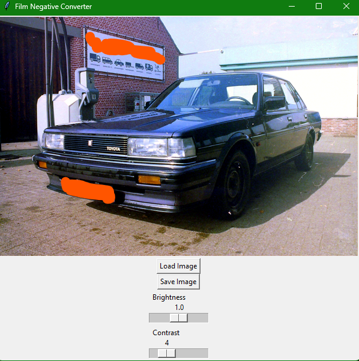

# NegativeConverter 📷🎞️

NegativeConverter is a Python program that converts a scan of a film negative to a positive image with some adjustable sliders. It uses Tkinter and PIL to process the scanned image and apply color correction and contrast enhancement. NegativeConverter is licensed under AGPLv3. It is currently still WIP!

## Installation

### Windows
You can grab the latest release in .exe from the ['Releases' page](https://github.com/LBBStudios/NegativeConverter/releases) 

### Linux / Mac

To install NegativeConverter, you need to have Python 3 and pip installed on your system. Then, you can clone this repository or download the zip file and extract it. Next, navigate to the project folder and run the following command:

```bash
pip install -r requirements.txt
```

## Usage
To use NegativeConverter, you need to have a scanned image of a film negative in JPEG or PNG format. You can use any cheap film scanner or camera to capture the negative, but make sure the image is well-lit and in focus.
Simply open the program and a GUI will pop up, there you can load your image and edit it until you're happy. Then save it out to a new file!


